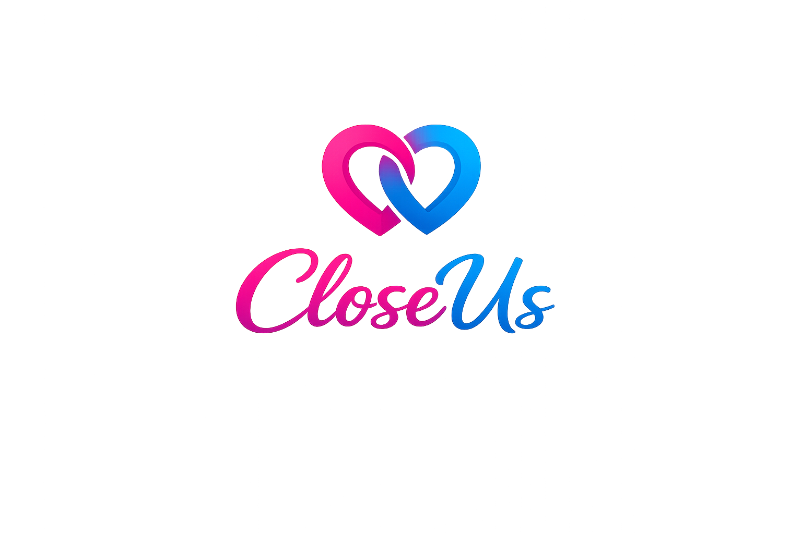

# CloseUs

> **Closer than ever.**  
> A private, dedicated digital space designed purely for two.

🌐 **Explore:** [https://close-us.vercel.app/](https://close-us.vercel.app/)

---

## 🚀 About The Product

**CloseUs** is a premium mobile application designed to help couples stay connected, deepen their bond, and create lasting memories. Unlike generic messaging apps, CloseUs is built specifically for one-to-one interaction, offering a private world just for you and your partner.

Whether you are in a long-distance relationship or living together, CloseUs adds a layer of fun, romance, and intentionality to your daily interactions.

---

## ✨ Key Features

### ❤️ **Private Pairing**
A secure and exclusive connection. Pair with your partner using a unique key to unlock your private dashboard. No friends, no groups—just the two of you.

### 📅 **Daily Squeeze**
Every day, receive a fun, deep, or thought-provoking question.
- **Blind Answers:** You can't see your partner's answer until you submit yours!
- **Daily Archive:** Build a history of your relationship through daily insights.

### 💬 **Real-Time Heartbeat Chat**
Stay in touch effortlessly.
- **Live Typing:** Feel their presence with real-time indicators.
- **Heartbeat Status:** See when your partner is online and active.
- **Multimedia:** Share photos, voice notes, and memories instantly.

### ⏳ **Our Journey Timeline**
A visual history of your relationship.
- **Milestones:** Track important dates like anniversaries and birthdays.
- **Time Together:** A live counter showing precisely how long you've been in love (Years, Months, Days).

### 🔔 **Smart Reminders**
Never miss a moment.
- **Updates:** Get notified when your partner answers the daily question.
- **Availability:** Know instantly when your partner comes online.

### 🛠️ **Couple Admin Tools**
(For internal use)
- **Analytics:** Insights into relationship engagement.
- **Campaigns:** Special events and notifications to keep the spark alive.

---

## 🔜 Coming Soon

We are working hard to bring you the ultimate couple's experience. Stay tuned for:
- **Couple Games:** Play mini-games like "Never Have I Ever" and "Would You Rather".
- **Mood Tracking:** Share how you're feeling without saying a word.
- **Memory Scrapbook:** A dedicated gallery for your best moments.

---

### **Status:** 🚧 In Development

*CloseUs is currently in closed beta testing. We are crafting every pixel to ensure a perfect experience for you.*

---

**Built with ❤️ for couples.**
*© 2026 CloseUs Team*
